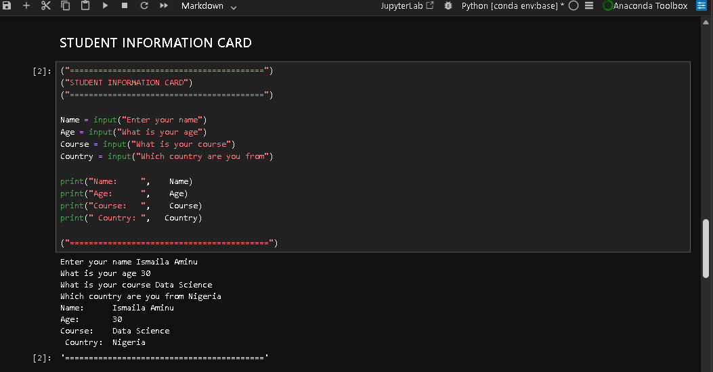
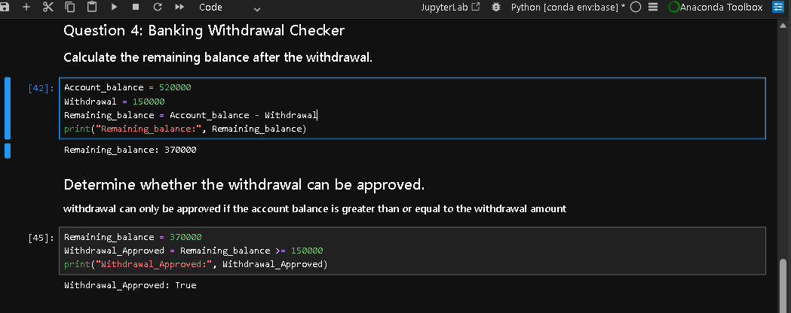
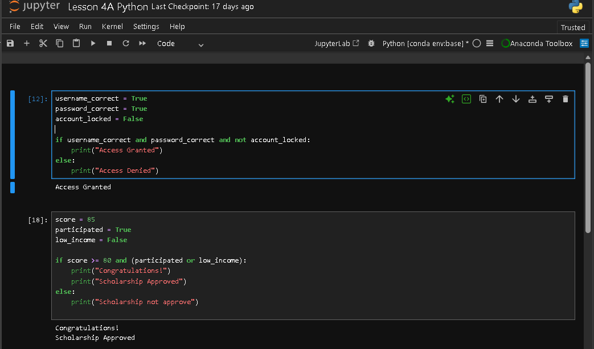
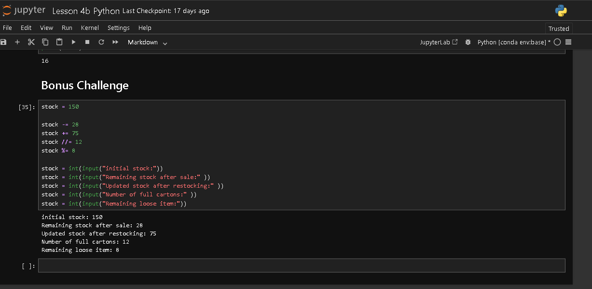
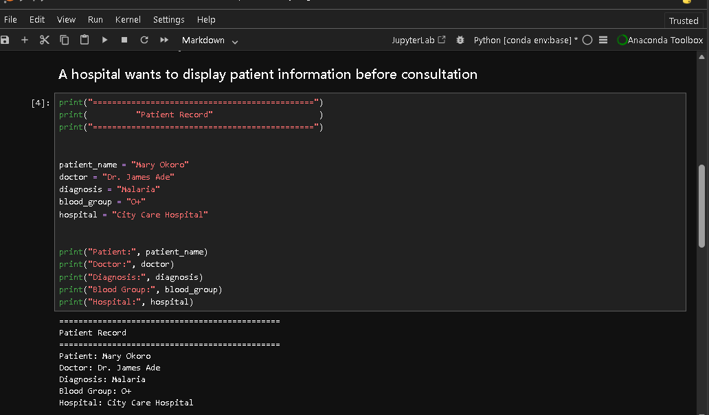
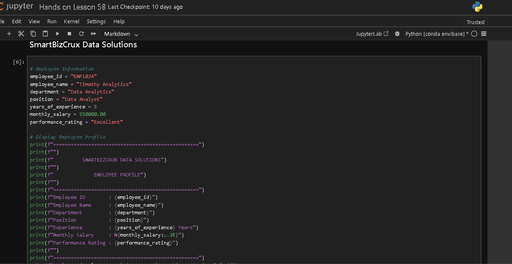
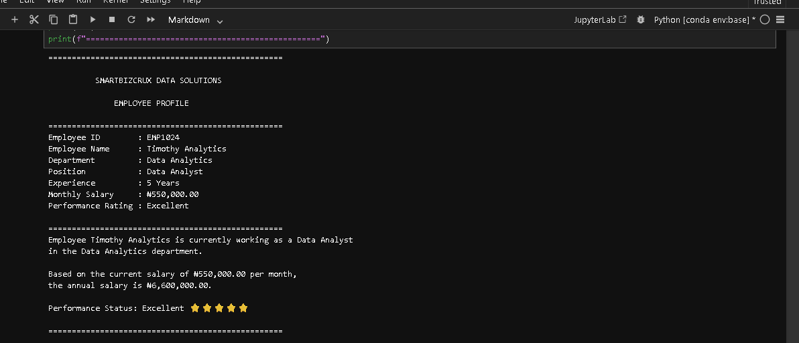
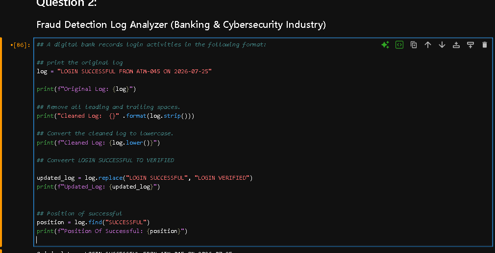
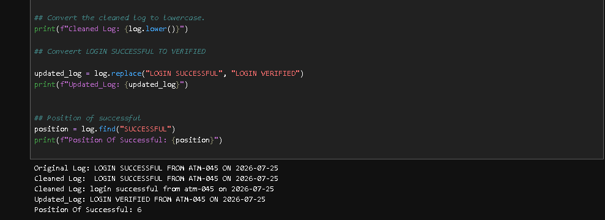
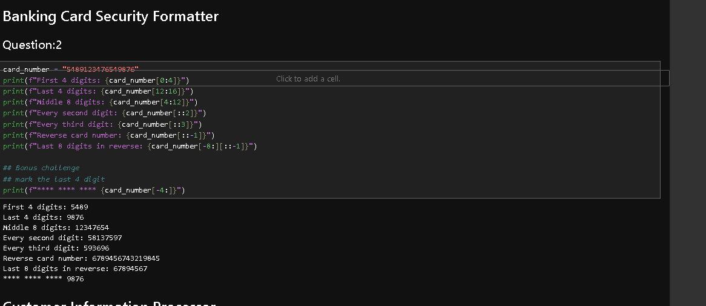

Python Study Group - Hands-on Projects
Overview
This repository contains the hands-on Python exercises and mini projects I completed during the first semester of the SmartBizCrux Python Study Group.

The projects are based on the topics covered in Lessons 1–6 and focus on building a strong foundation in Python through practical exercises and business-related scenarios.

Topics Covered
Print
Variables
Data Types
User Input
Arithmetic Operators
Comparison Operators
Logical Operators
Strings
String Indexing
String Slicing
String Formatting (f-strings)
Skills Practised
Writing and running Python programs
Working with variables and data types
Accepting user input
Performing arithmetic calculations
Using comparison and logical operators
String manipulation (indexing, slicing, and formatting)
Using conditional statements
Debugging and correcting syntax errors
Solving simple business-related programming problems
Mini Projects
1. Student ID Card Generator
Created a simple student ID card using print() and input().

2. Smart Shopping Discount Calculator
Calculated purchase discounts using arithmetic and logical operators.

3. Banking & Finance Fund Approval
Used arithmetic and logical operators to determine fund approval based on simple conditions.

4. Retail & E-commerce Receipt Generator
Generated a customer receipt using variables, user input, arithmetic operations, and formatted output.

5. Customer Feedback Management System
Used strings and f-strings to generate a formatted customer feedback report.

6. HR & Payroll Employee Profile Generator
Calculated annual salary, annual bonus, and displayed employee information using variables, arithmetic operations, conditional statements, and f-strings.

What I Learned
Through these exercises, I learned how to:

Work with Jupyter Notebook.
Write and run Python code in an interactive environment.
Debug syntax and logical errors.
Apply Python fundamentals to solve programming problems.
Build confidence by practising with different business scenarios.
Tools Used
Python 3
Jupyter Notebook
GitHub
Repository Structure
Each notebook contains the exercises completed during the SmartBizCrux Python Study Group and follows the order of the lessons covered in class.

